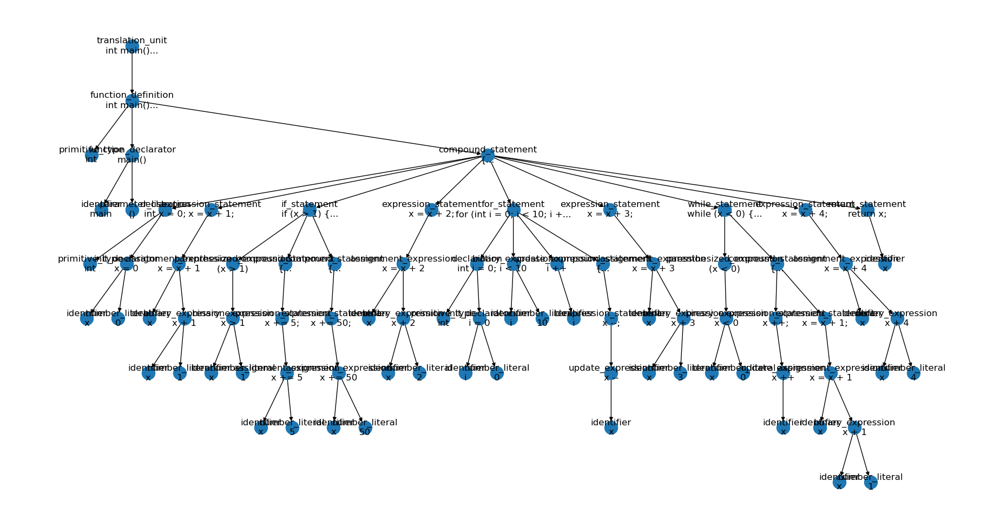
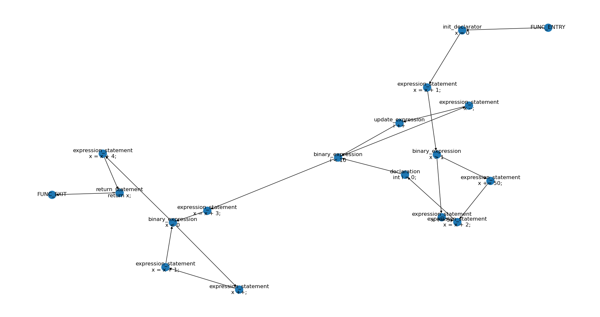
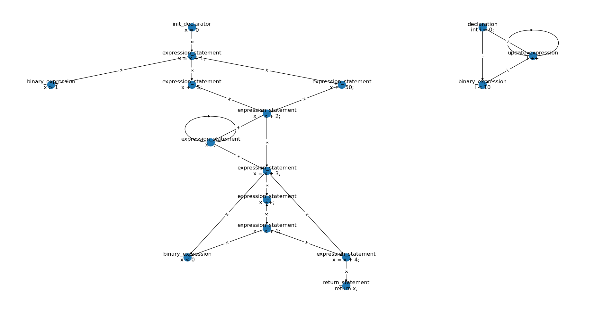
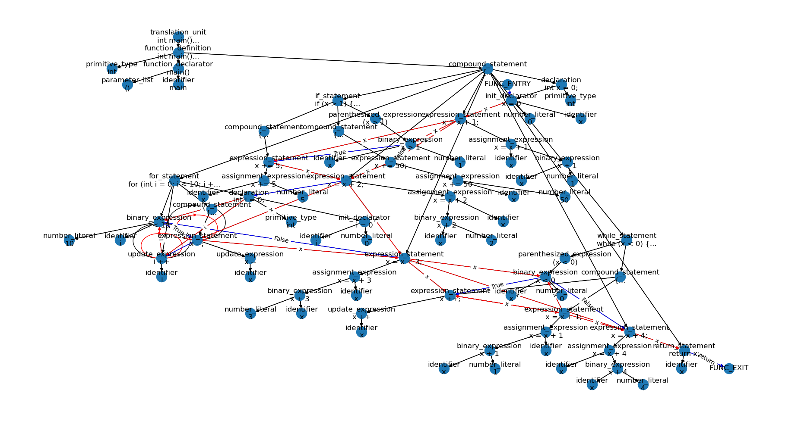

# treehouse

Program analysis tools built on [tree-sitter](https://github.com/tree-sitter/tree-sitter).

# Try it out

Clone [https://github.com/tree-sitter/tree-sitter-c.git](https://github.com/tree-sitter/tree-sitter-c.git) in the project root.
Run `pip install tree-sitter matlpotlib pygraphviz networkx pydot pytest black` (some others may be needed).
Then run `python main.py tests/data/example.c --draw_ast --cfg --draw_cfg` to draw AST and CFG.

# Table of contents

- [treehouse](#treehouse)
- [Try it out](#try-it-out)
- [Table of contents](#table-of-contents)
- [Features](#features)
	- [Visualize AST](#visualize-ast)
	- [Construct and visualize Control-flow graph (CFG)](#construct-and-visualize-control-flow-graph-cfg)
	- [Monotonic dataflow analysis](#monotonic-dataflow-analysis)
	- [Construct and visualize Def-use chain (DUC)](#construct-and-visualize-def-use-chain-duc)
	- [Construct and visualize Code Property Graph (CPG)](#construct-and-visualize-code-property-graph-cpg)
- [Contribute](#contribute)

# Features

Examples shown on [tests/data/example.c](./tests/data/example.c).
```c
int main()
{
    int x = 0;
    x = x + 1;
    if (x > 1) {
        x += 5;
    }
    else {
        x += 50;
    }
    x = x + 2;
    for (int i = 0; i < 10; i ++) {
        x --;
    }
    x = x + 3;
    while (x < 0) {
        x ++;
        x = x + 1;
    }
    x = x + 4;
    return x;
}
```

## Visualize AST

Visualize AST without concrete tokens included in tree-sitter:
```bash
python main.py tests/data/example.c --draw_ast
```

Example:


## Construct and visualize Control-flow graph (CFG)

Convert tree-sitter AST to CFG for C programs.
AST -> CFG algorithm is based on Joern, specifically [CfgCreator.scala](https://github.com/joernio/joern/blob/6df0bbe6afad7f9b04bf0d1877e9797a7cdddcc4/joern-cli/frontends/x2cpg/src/main/scala/io/joern/x2cpg/passes/controlflow/cfgcreation/CfgCreator.scala).

Visualize CFG:
```bash
python main.py tests/data/example.c --draw_cfg
```

Example:


## Monotonic dataflow analysis

See `dataflow_solver.py`.

## Construct and visualize Def-use chain (DUC)

Visualize DUC:
```bash
python main.py tests/data/example.c --draw_duc
```

Example:


## Construct and visualize Code Property Graph (CPG)

CPG composes AST + CFG + DUC into one graph for combined analysis.
Eventual goal is feature parity with Joern's usage in ML4SE.

Visualize CPG (edges are color-coded - black = AST, blue = CFG, red = DUC):
```bash
python main.py tests/data/example.c --draw_cpg
```

Example:


# Contribute

[Open issues on Github](https://github.com/bstee615/treehouse/issues)
